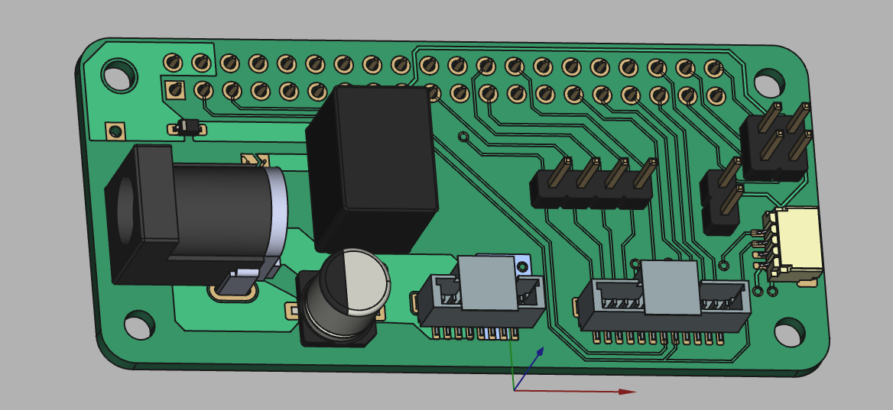

# PCB design

To control the DMD with a raspberry pi, we need a very simple board that allows us to plug in the original Anhua board's connectors (Molex Pico-clasp). Check out [the schematic 🗺](elegoo-dlp-controller.pdf) for the quickest overview of all functionality.

To make our life a little easier, you can add an (optional) dc-dc converter that also converts the 12V to 5V and uses that to power the raspberry pi. This means you do not need to apply separate 5V power to the raspberry pi, and that the 12V needed for the Anhua board provided by the Elegoo Mars 4's power supply is enough to power everything.

Finally, the board breaks out some extra pins for adding your own extra custom bits. SPI and I2C connections, as well as some spare GPIO pins. This may be useful if you want to have exposure occur based on some sensor readout, or maybe tie UV exposure to a simple button for batch production where you don't want to send commands over SSH.

```
> [!IMPORTANT]  
> Not every connection has been verified to work. I suspect they are all fine since its not a very complex board or high frequency signals. At least the minimum set of pins required for data/exposure seem to work fine.
```



### Bill of materials

The costs below are indicative, as shipping cost and price changes may have occurred since writing this document. Check with KiCAD's schematic to see if it all up to date. All listed values are including taxes (21%).

| Description                | Supplier         | Supplier Part Number | Amount | Total Cost | Comment                                      |
| -------------------------- | ---------------- | -------------------- | ------ | ---------- | -------------------------------------------- |
| PCB manufacturing          | Aisler           |                      | 3      | 14         | MOC 3pcs                                     |
| Raspberry Pi Zero 2        | Mouser           | 358-SC0510           | 1      | 17         |                                              |
| Micro SD Card (32GB)       | Kiwi Electronics | TS32GUSDU1           | 1      | 10         | Whatever kind you want would work            |
| Raspberry pi header        | Kiwi Electronics | KW-2639              | 1      | 2          | or any basic, cheaper header                 |
| Raspberry pi header female | Kiwi Electronics | KW-1650              | 1      | 1.5        |                                              |
| JST SH 4-pin               | Mouser           | 474-PRT-14417        | 1      | 0.67       | Optional, allows i2c through  stemmaQT/QWIIC |
| Molex PicoClasp 12 pin     | Mouser           | 538-501331-1207      | 1      | 1.19       |                                              |
| Molex PicoClasp 8 pin      | Mouser           | 538-501331-0807      | 1      | 0.92       |                                              |
| Cui DC-DC converter        | Mouser           | 490-P78E05-1000      | 1      | 3.45       |                                              |
| Barreljack                 | Mouser           | 490-PJ-002B          | 1      | 0.79       |                                              |
| Schottky Diode             | Mouser           | 771-PMEG1020EJ-T/R   | 1      | 0.29       |                                              |
| 100uF capacitor            | Mouser           | 667-EEE-FN1E101UP    | 1      | 0.57       |                                              |
|                            |                  |                      |        |            |                                              |
| Total                      |                  |                      |        | 52.38      |                                              |

### Miscellaneous

* Board was designed in KiCAD 7.0
* I had the board fabricated at Aisler (Germany), at 14 euros (total) for 3 boards.

