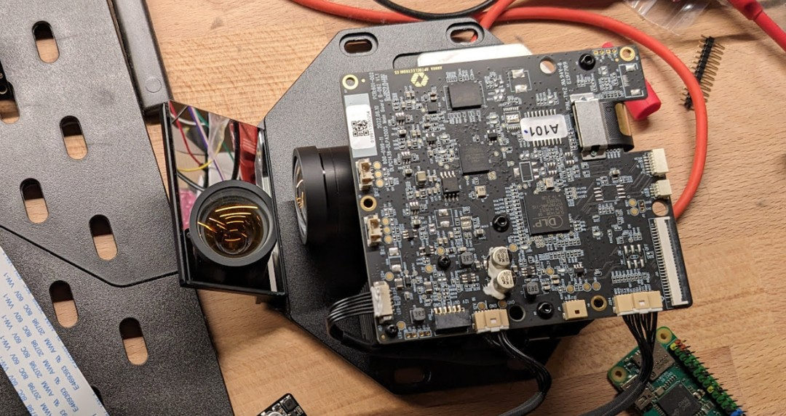

# Raspberry Pi hat for Elegoo Mars 4 DLP board 

A hat for the raspberry pi that allows a resin 3D printer's **UV light** projector to be controlled. Note that this is (in direct form) only suitable for the projector in the Mars 4 DLP. If you have other boards check out the repository for the [Anycubic Photon Ultra](https://github.com/openMLA/photon-ultra-controller), or get in touch for modifications needed. 

The designs in this repository then allow you to project arbitrary **2560x1440** images with UV light on a surface. The native projected pixel size is **50μm**, making PCB fabrication an interesting application. All you would need is a bit of glue code to convert the Gerber files to a rasterised image and then you could easily use the existing 3D printer frame to expose PCB boards. Since you have all the files and access to the code, you can easily tune it to whatever production needs you have.

The UV projector of the Elegoo Mars 4 DLP is [developed and produced by Anhua (D63ZS50B)](https://www.anhuaoe.com/en/industriause/info.aspx?itemid=2694), and seems to be this variety. Under the hood it uses the Texas Instruments DLP300s or DLP301s digital micromirror array.

> [!NOTE]  
> While PCB fabrication is the most straightforward application for this board, this is actually developed as part of an effort towards an open hardware photolithography system. Check out the [openMLA organisation](https://github.com/openMLA/) for more info.

### 🚀 At a glance

Running an SPI clock of ~125MHz it takes:

* ~0.75s to send a full 1440p image to the projector
* ~0.18s to send a 720p image to projector

Arbitrary sections of the display can be updated for even shorter transfer times. Note the maximum framerate (below) and that due to technical reasons the smallest image block that can be sent (in terms of transfer size) is 128x2 pixels. 

The image is stored in a buffer in the FPGA, so you can incrementally build or update an image, if that saves you time or makes your life easier.

The max achievable framerate seems to be about 10Hz (as there are some artefacts if you update faster). This is not a hard limit I suspect, and it may be possible to get closer to the display signal framerate of 60Hz.

### 💡 Sourcing the Projector

The easiest and cheapest way to source the projector is to buy a Elegoo Mars 4 DLP. At the time of writing (2024-02-02) the resin printer can be purchased in the EU for 275 euro (discounted).

Alternatively, the projector can be purchased directly from Anhua; but there may be small differences in the heatsink, LED source and other items. Also expect to pay a premium due to shipping, broker cost etc.

### 📃 Project BOM

The total costs for the project consists of 3 parts:

| Expense Description        | Cost  |
| -------------------------- | ----- |
| Elegoo Mars 4 DLP          | 274   |
| Electronics/PCB            | 52.38 |
| Enclosure/3D printed parts | -     |

_The PCB costs are further broken down [in the BOM in the PCB directory](./PCB/README.md)_

### 🎁 3D printable enclosure

A basic 3D printable enclosure is available in the enclosure directory. 

### 🛠 Disassembly 

Disassembly of the printer is not difficult, but I suggest you take a look at the points below before starting.

1. Make sure the projector is working properly by running the display test functions on the original elegoo board.
2. Raise the Z axis all the way to the top. It will only get in the way otherwise. You can also completely remove it later.
3. Remove the front panel. You will need allen keys and philips head screwdrivers. Carefully disconnect the display ribbon cable. Now you should be able to reach the connectors on the mainboard.
4. Disconnect all the connectors on the elegoo mainboard (the one not on top of the projector unit).
5. Undo the screws holding the bottom section of the printer enclosure in place. Now you carefully try to slide it forward and out of the way of the projector. This can be a bit tricky.
6. [optional] If don't want to use the projector in the original elegoo enclosure, you can remove it from the case with the 4 philips head screws holding it in place.

### 🛠 Assembly 

Assembly of the board is pretty straightforward. For completeness, here are the steps you will need to take.

1. Solder headers onto raspberry pi zero.
2. Assembly the custom PCB
3. Flash Raspberry Pi OS Lite onto an micro SD card. You can use [the raspberry pi imager](https://www.raspberrypi.com/software/) for this. Make sure to configure the wireless connection and ssh access in this step.
4. Attach the custom PCB to the raspberry pi zero header.
5. Plug in the 2 pico-claps connectors that were connected to the original elegoo mainboard
6. Plug in the original elegoo power supply to the barrel jack on the custom PCB.
7. Follow the more detailed [software setup](software-setup.md) to get the Pi up and running. 
8. [optional] if you want to use the projector inside the original enclosure, you can check out the instructions in [the enclosure directory](./enclosure/README.md)

### ✅ Future plans

2. Polish package with proper debug level logging and maybe proper formatted python documentation.
3. Add CRC16 checks. (low priority)