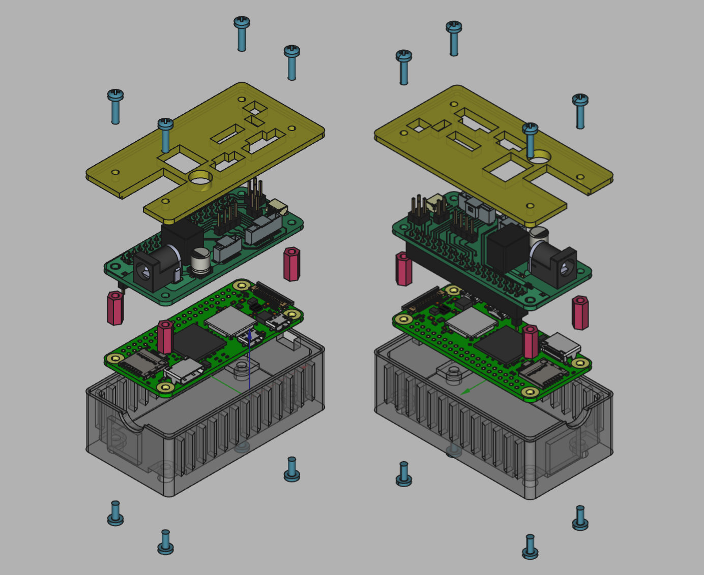
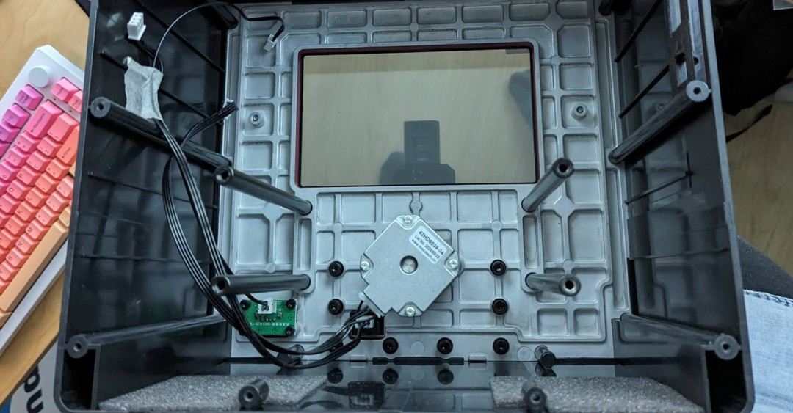
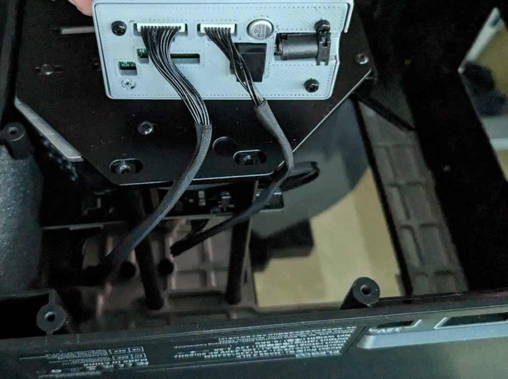
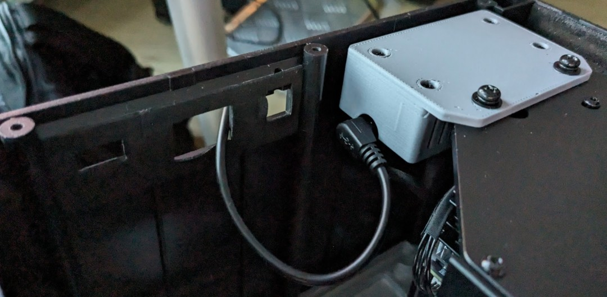

# Simple PCB Enclosure

To protect the raspberry pi zero and the PCB from damage and shorts you can 3D print the enclosure files in this directory.

Designed in FreeCAD. PCB was imported into FreeCAD with the [KiCAD StepUp plugin](https://www.kicad.org/external-tools/stepup/).

Step files can be sliced in e.g. PrusaSlicer.

### Fasteners

In order to put this together you will also need:

* 4X M2.5 6mm screw
* 4X M2.5 10mm screw
* 4X DIN 6334 M2.5 10mm coupling nuts

### Using the enclosure inside the original Elegoo 3D printer

An alternative `.step` exists that has some extra mounting points that can mount onto the mounting points of the Projector.  That one is recommended if you want to keep using the 3D printer as a base for your project. You can of course also just print the normal case file and glue/tape it in place somewhere inside the case.

Some tips for assembling:

1. Tape the stepper, endswitch and USB power cables somewhere off to the side. Otherwise they may end up blocking the light from the projector.
   
2. Avoid straining the pico-clasp cables
   
3. Route the original 12V power supply through one of the now open ports. It's not very elegant, so if you are interested you can modify the PCB or the case design to nicely route the power cable
   
4. Tape these open ports shut, to prevent leakage of UV light.
5. Keep the original touchscreen in place on the unit, as it will block the UV light. If you want to be extra secure, you can also apply some tape to the edges of the screen to really prevent UV leakage.

### External 3D models

The Model of the raspberry Pi zero 2 was downloaded from [the geekworm wiki](https://wiki.geekworm.com/Raspberry_Pi_Zero_2_W) on 28th of february 2023.